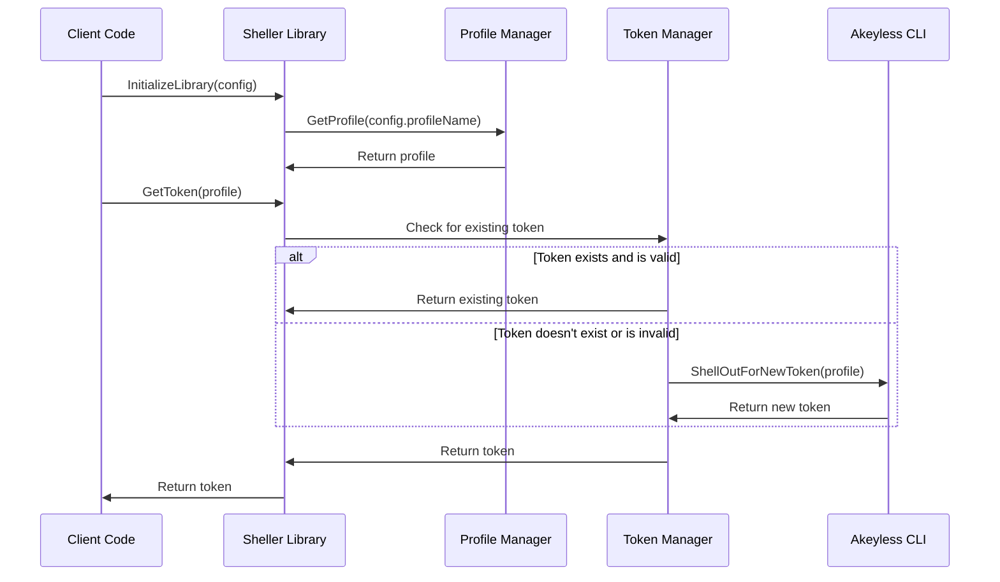

# Akeyless Sheller

A Go library for simplifying the process of authenticating and managing tokens with the Akeyless CLI. This library handles token retrieval and management, ensuring tokens are reused when valid and only re-authenticating when necessary to reduce unnecessary user prompts while delegating the authentication process to the Akeyless CLI for maximum security and support for all authentication methods.

## Getting Started

1. **Install Library:**

```bash
go get github.com/akeyless-community/akeyless-sheller/sheller
```

## Sequence Diagram

The following sequence diagram provides an overview of how the `sheller` library operates:



## Example Quickstart

The following code snippet provides a quickstart example of how to use the `sheller` library to obtain a token for a specified profile:

```go
package main

import (
    "fmt"
    "time"

    "github.com/akeyless-community/akeyless-sheller/sheller"
)

func main() {
    // Define the configuration
    config := sheller.NewConfigWithDefaults()

    // Initialize the sheller library and get the token
    token, err := sheller.InitializeAndGetToken(config)
    if err != nil {
        fmt.Printf("Failed to initialize and get token: %v\n", err)
        return
    }

    // Print the obtained token
    fmt.Printf("Obtained token: %v\n", token.Token)
}

```

## Example Full Implementation

The `main.go` file in the root directory serves as an example implementation of the `sheller` library. Below is a brief explanation of how it operates:

1. Define the configuration using `sheller.NewConfig`.
2. Initialize the `sheller` library using `sheller.InitializeLibrary`.
3. Load the specified profile using `sheller.GetProfile`.
4. Obtain a token for the specified profile using `sheller.GetToken`.
5. Print the obtained token to the console.

```go
package main

import (
    "fmt"
    "sheller"
    "time"

    "github.com/akeyless-community/akeyless-sheller/sheller"
)

func main() {
    // Define the configuration
    config := sheller.NewConfig(
        "", // will pull from path if akeyless CLI is on system path
        "default", // the name of the CLI profile to use
        "/Users/chrisgruel/.akeyless", // the path to the Akeyless home directory usually located at ~/.akeyless
        10*time.Minute, // if the token expiration is within this upcoming interval, a new token will be obtained
    )

    // Initialize the sheller library
    err := sheller.InitializeLibrary(config)
    if err != nil {
        fmt.Printf("Failed to initialize sheller library: %v\n", err)
        return
    }

    // Load the specified profile
    profile, err := sheller.GetProfile(config.Profile, config)
    if err != nil {
        fmt.Printf("Failed to load profile: %v\n", err)
        return
    }

    // Get a token for the specified profile
    token, err := sheller.GetToken(profile, config)
    if err != nil {
        fmt.Printf("Failed to get token: %v\n", err)
        return
    }

    // Print the obtained token
    fmt.Printf("Obtained token: %v\n", token.Token)
}
```

## Library Structure

- `sheller/config.go`: Defines the configuration structure and provides a function to initialize the library.
- `sheller/profile.go`: Provides functions to load and list Akeyless CLI profiles.
- `sheller/token.go`: Provides functions to check for existing tokens, shell out for new tokens, and retrieve tokens for specified profiles.

## Testing

To run the provided tests, use the following command:

```bash
go test ./...
```

## License

This project is licensed under the terms of the Apache 2.0 license. See the [LICENSE](LICENSE) file for details.
